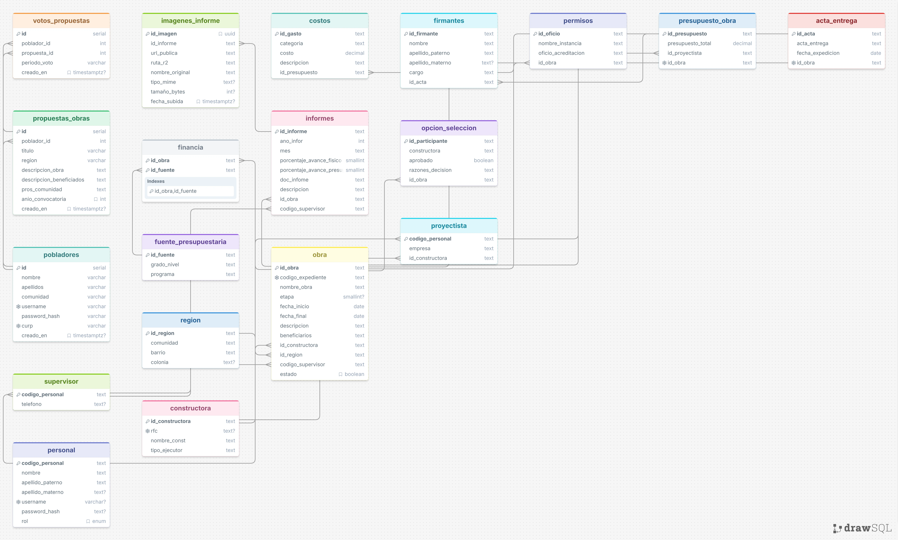

# Ejercicio 5. Modelo EER del Proyecto "Obra Pública Municipal"

Diagrama obtenido de DrawSQL mediante el código SQL obtenido del [**fork creado**](https://github.com/OmarFloresIIA/PublicMunicipalWorks_DWH) en la ruta "/PublicMunicipalWorks_DWH/db/DDLBASEObPub.sql"

---

## 1. Identificación de Jerarquías y Entidades Débiles (Punto 3)

### A. Entidades Débiles
* **`imagenes_informe`:** Es una entidad débil cuya existencia depende totalmente de la entidad `informes` (a través del atributo `id_informe`). Las fotografías registradas no tienen valor ni existencia dentro del dominio sin un informe técnico al cual respaldar.
* **`costos`:** Depende directamente de la entidad `presupuesto_obra` (a través de `id_presupuesto`). Un desglose de costo individual no puede existir dentro de la base de datos sin estar asociado a una cabecera de presupuesto general.
* **`votos_propuestas`:** Depende de la existencia conjunta de las entidades `pobladores` y `propuestas_obras`.

### B. Jerarquía (Especialización / Herencia)
* **Entidad Padre (Superclase):** `personal` (atributos comunes: `codigo_personal`, `nombre`, `apellido_paterno`, `username`, `password_hash`, `rol`).
* **Subclases (Especializaciones):**
  * `proyectista` (extiende con atributos específicos: `empresa`, `id_constructora`).
  * `supervisor` (extiende con atributo específico: `telefono`).
* **Justificación:** En el dominio del sistema, un proyectista o supervisor es ante todo un empleado/persona (`personal`) con credenciales y datos de identidad, que asume responsabilidades y atributos especializados dependiendo del rol asignado en la obra pública.

---

## 2. Tabla de Correspondencia: Modelo Relacional vs. Data Warehouse SQL (Punto 4)

| Entidad / Concepto del Dominio (Relacional) | Tabla(s) en el Data Warehouse Publicado | Información que se Agrega o Modifica | Información que se Pierde |
| :--- | :--- | :--- | :--- |
| **`obra`**, **`presupuesto_obra`**, **`acta_entrega`** | `dim_obra`, `dim_presupuesto`, `fact_obra_mensual` | Se agregan llaves subrogadas (`_sk`), campos para control de versiones SCD Type 2 (`fecha_inicio_validez`, `es_actual`) y métricas de avance mensual acumulado. | Se pierden las llaves foráneas directas hacia documentos individuales (`acta_entrega`), desnormalizando la información en dimensiones consolidadas. |
| **`pobladores`**, **`propuestas_obras`**, **`votos_propuestas`** | `dim_poblador`, `dim_propuesta` | Se consolidan contadores analíticos globales de votos e iniciativas directamente sobre las dimensiones de participación ciudadana. | Se pierde el registro individual del hash de contraseña (`password_hash`) por privacidad y el detalle transaccional instante a instante de cada voto. |
| **`personal`**, **`proyectista`**, **`supervisor`** | `dim_personal` | Se aplana la jerarquía de herencia en una sola dimensión con un atributo diferenciador de rol y rastreo histórico de cambios de adscripción. | Se pierde la separación en tablas especializadas (`proyectista`/`supervisor`), unificando los atributos en un catálogo general. |
| **`informes`**, **`imagenes_informe`**, **`firmantes`** | `fact_eventos_auditoria` | Se transforman los informes administrativos en métricas de eventos de auditoría con banderas de anomalía y montos observados. | Se pierden las rutas complejas de archivos adjuntos (`doc_infome`) y los nombres de firmantes individuales, sintetizándolos en códigos analíticos de fiscalización. |
| **`financia`**, **`fuente_presupuestaria`** | `dim_fuente` | Se generan identificadores categóricos para clasificar el origen de los recursos (estatal, federal, municipal). | Se elimina la tabla pivote de relación M:N (`financia`), asignando el origen del recurso como una dimensión directa de la obra. |