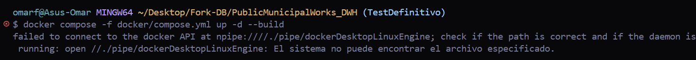
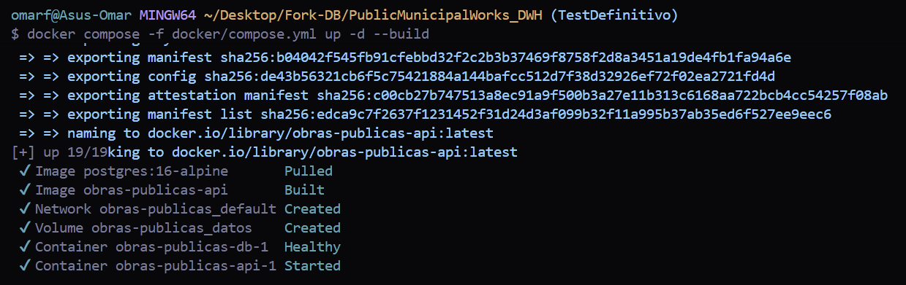
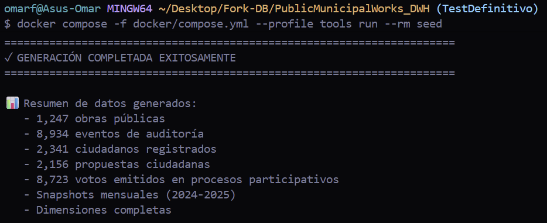
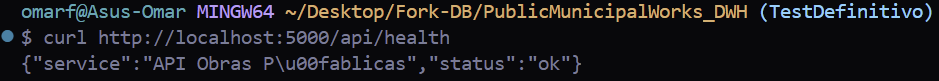
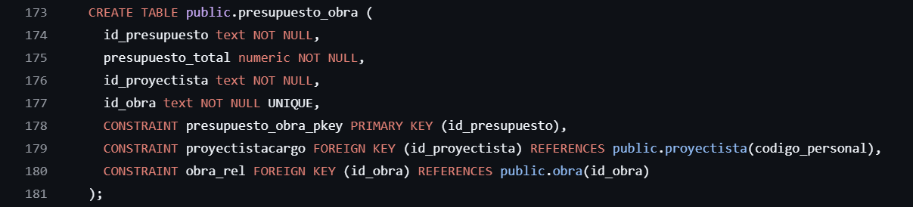
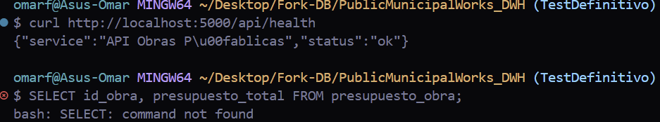
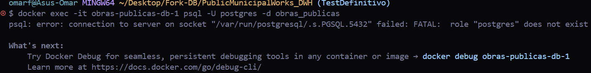
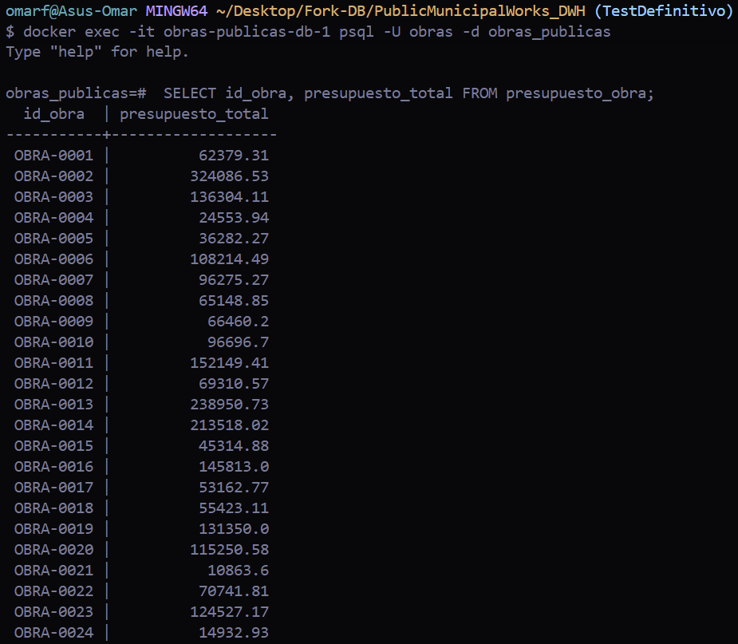

# Levantamiento del proyecto "Obra pública municipal"
## Primeros pasos
La primera vez que empece a leer el **README.md** del proyecto senti una carga masiva de información, asi que pase directamente a buscar las instrucciones para poner en funcionamiento el proyecto en mi equipo, en la sección **Running the reference API** encontre 3 comandos que el README indica para levantar el contenedor de docker. Pero al ejecutar el primer comando, me arrojó este error:

```bash
    docker compose -f docker/compose.yml up -d --build     # PostgreSQL + API
```

---

---

Entonces me acorde de un punto clave **"Primero tengo que abrir Docker"**, asi que lo abrí y volví a intentar con el mismo comando, y funcionó:

---

---

Eso me inspiró más y ejecute el siguiente comando:

```bash
    docker compose -f docker/compose.yml --profile tools run --rm seed
```

Y funcionó perfectamente, aunque si se tardo un poco.

---

---

Ya solo faltaba el tercer comando, después de eso ya iba a poder hacer la primer consulta, asi que lo ejecute:

```bash
    curl http://localhost:5000/api/health
```

Y mostro el estado "ok" lo cual era una buena señal.

---

---

Posteriormente, para hacer la primer consulta tenia que entender bien la estructura del sistema, asi que esta vez, ya leí el README con mas detenimiento.
Esto me llevo a la carpeta **"db"** la cual contiene todo el codigo **SQL** que construye las tablas de la base de datos, lo cual nos ayudará mas adelante para poder hacer la ingeniería inversa y entender de mejor manera la estructura de esta base de datos, por esa ocasión solo me enfocaré en hacer la consulta de alguna tabla que me parezca interesante, a continuación se muestra una captura de la tabla de la cual me base:

---

---

Asi que pase a la terminal y ejecute la siguiente consulta:

```bash
    SELECT id_obra, presupuesto_total FROM presupuesto_obra;
```

Al darle enter, me salió este mensaje:

---

---

Esto sucedió porque aún no me había conectado al cliente interactivo de PostgreSQL (psql) dentro del contenedor Docker.
Para conectarme a la base de datos dentro del contenedor, ejecuté inicialmente:

```bash
    docker exec -it obras-publicas-db-1 psql -U postgres -d obras_publicas
```

Sin embargo, el servidor me devolvió el siguiente error:

--

--

Después de revisar el README y las credenciales, me di cuenta de que la configuración de docker definia la variable de entorno *POSTGRES_USER=obras*, y no postgres como lo había puesto yo.
Con esta información, ejecuté la conexión utilizando el usuario nativo correcto:
```bash
    docker exec -it obras-publicas-db-1 psql -U obras -d obras_publicas
```

Una vez dentro de la consola interactiva de psql, pude ejecutar la consulta que quería hacer desde el principio:

```bash
    SELECT id_obra, presupuesto_total FROM presupuesto_obra;
```

Y obtuve el siguiente resultado:

---

---

## Conclusiones y resultados de la consulta

Como resultado final del levantamiento, se logró ejecutar exitosamente la primera consulta DDL/DML directamente sobre el gestor de base de datos dentro del contenedor en ejecución:

```sql
SELECT id_obra, presupuesto_total FROM presupuesto_obra;
```

La salida obtenida en la terminal (*psql*) confirmó la correcta comunicación con la base de datos obras_publicas, desplegando los registros de los identificadores de obras (*id_obra*) junto con sus presupuestos totales asignados (*presupuesto_total*).